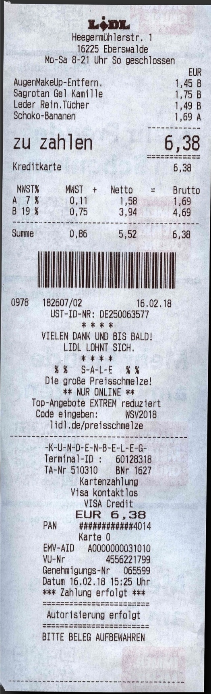

# Ai Desk

Automate common tasks with the help of AI

-   [x] Name scanned PDFs
-   [x] Add meta data to scanned PDFs
-   [x] Convert images to PDFs
-   [ ] Join Images to one PDF
-   [ ] Join PDFs to one PDF

# Required

-   Java 21
-   https://github.com/ocrmypdf/OCRmyPDF
-   https://ollama.com/
-   docker e.g. https://docs.docker.com/desktop/

# AI Scores - Einfache LIDL Rechnung "M1 16GB"

## TLDR

1. Try **qwen3:4b** or **gemma3:4b**, if you have not many resources
1. If you have plenty of RAM 24GB / VRAM 16 GB try first **granite3.3:8b** next **qwen3:8b**
1. If you have more RAM (>=32GB) you also test **gemma3:12b** if it creates better results

## Summaries

| LLM  | Rechnung Hotel Stern | LIDL Rechnung |
| ---- | -------------------- | ------------- |
| qwen3:4b | 17/40 = 42% | 7/31 = 22% |
| qwen3:8b | 15/40 = 37% | 6/31 = 19% |
| qwen3:14b | failed | failed |
| gemma3:4b | 12/40 = 30% | 7/31 = 22% |
| gemma3:12b | 16/40 = 40% | 9/31 = 29% |
| gemma3:27b | 15/40 = 37% | 8/31 = 25% |
| mistral:7b | 14/40 = 35% | 7/31 = 22% |
| granite3.3:8b | 9/40 = 22% | 2/31 = 6% |
| llama3.1:8b | 12/40 = 30% | 9/31 = 29% |
| deepseek-r1:14b | failed | failed |
| gpt-oss:20b | failed | failed |

=> deepseek-r1:14b is very unstable works only sometimes

# Benchmarks

**Results differ a bit from run to run**

- [Benchmark details](./Benchmark.MD)

## LIDL Rechnung



## Hotel Muster Rechnung

[Musterrechnung](src/test/resources/Musterrechnung_ocr.pdf)

# ocrmypdf

`docker run -i --rm jbarlow83/ocrmypdf --skip-text -l deu - - < in.pdf > out.pdf`

```
ProcessBuilder pb = new ProcessBuilder(
        "docker", "run", "-i", "--rm", "jbarlow83/ocrmypdf", "-l", "deu", "-", "-"
);
```

```
for filename in ./*.pdf; do
  docker run — rm -v=$(pwd):/tmp jbarlow83/ocrmypdf -l deu /tmp/${filename#./} /tmp/out/${filename#./}
done
```

# Using / based on

-   https://github.com/ocrmypdf/OCRmyPDF
-   https://ollama.com/
-   https://pdfbox.apache.org/
-   https://spring.io/projects/spring-boot
